# Digitalröhrenuhr
Mein Projekt ist es eine Uhr zu designen. 4 Digitalröhren werden als Einzeigeelement eingebaut.
Die Ansteuerung der Röhren fungiert über Schieberegister.
Für die Daten der Uhrzeit wird ein Timermodul DS3231 eingebaut.
Der Arduino regelt die Kommunikation des Timermoduls und verarbeitet diese Daten und steuert mehrere Schieberegister an, welche so die Anzeige regulieren.
Das Format der Uhr ist HH:MM. Zusätzlich werden 2 LEDs für den Doppelpunkt angesteuert. Diese können für die Anschaulichkeit durch RGB LEDs erweitert werden.

## Anforderungen
| Anforderung                                                                                                                         | Muss | Wunsch |
| -------------------------------------------------------------------------------------------------------------------                 | ---- | ------ |
| Der Arduino kommuniziert per I2C mit dem Timermodul DS3231                                                                          | X    |        |
| Ansteuerung Anzeigeelemente. Arduino verarbeitet Daten für Stunden und Minuten und schreibt diese auf Schieberegister               | X    |        |
| Uhrzeit wird durch den batteriebetriebenen Timerbaustein gemerkt und läuft korrekt weiter auch wenn die Uhr nicht angeschlossen ist | X    |        |
| LEDs für den Doppelpunkt können konstant leuchten oder im Sekundentakt blinken                                                      | X    |        |
| LEDs werden durch RGB LEDs erweitert                                                                                                |      | X      |
| Anschauchlichkeit. Bei einer vollständigen Stunde laufen die Zahlen bei allen Anzeigeelementen von 0 bis 9 mehrmals schnell durch   |      | X      |                                                       

## Projektplan
- 14.12.2024 - Projektplanbesprechung
- 14.12.2024 - Flussdiagramm erstellt
- 14.12.2024 - Projektplan erstellt
- 18.01.2024 - Kompatibilität von Hardware überprüft
- 20.12.2024 - Schaltung für Versorgungsspannungen designt und getestet
- 21.12.2024 - DS3231 Timerschaltung und Ansteuerung getestet
- 22.12.2024 - Schieberegister Ansteuerung getestet
- 23.12.2024 - Digitalröhren Anstuerung getestet
- 28.12.2024 - Softwarecode geschrieben
- 30.12.2024 - Softwarecode verständlich kommentiert
- 01.01.2024 - Tests abgeschlossen
- 04.01.2025 - Projektabschluss (Video, Dokumentation, Präsentation)

## Flussdiagramm

Der Arduino komminziert über eine I2C-Schnittstelle mit dem Timermodul DS3231. Dadurch gelangt er an die Daten für Stunden und Minuten. Der Mikrocontroller schreibt per digitalen Ausgang
diese Daten auf ein Schieberegister, damit die entsprechenden Zahlen angezeigt werden. HH:MM

## Projektbeschreibung

Im Video wird alles deutlicher erklärt. Schauen Sie dies zuerst an.

### Teilfunktionen
- **Getestete Teilfunktionen:**
  - Kommunikation zwischen Arduino, Schieberegister und Transistor-ICs
  - Kommunikation zwischen Adafruit DS3231 Timermodul und Arduino
  - Spannungsprüfung der Module
  - Versuchsaufbauten für Transistoransteuerung

### Herausforderungen
- Anfangsprobleme:
  - Die IV-3A-Röhren aus Russland verfügten über kein brauchbares Datenblatt. Mithilfe diverser Foren und Google Translate konnte ein russisches Datenblatt übersetzt werden:
    - [Datenblatt auf Russisch](https://zw-ix.nl/wp-content/uploads/2019/08/IV-6.pdf)
    - Blog mit hilfreichen Informationen: [ZW-IX Blog](https://zw-ix.nl/blog/tag/iv3-a-datasheet/)

- **Fehlerhafte Informationen:**
  - Anfangs wurden für Ströme und Spannungen umfangreiche Berechnungen durchgeführt, die sich als redundant herausstellten, da keine Strombegrenzung erforderlich war.

### Komponentenwahl

Durch ein YouTube-Video entdeckte ich den **TBD62783APG**, einen perfekten IC für die Ansteuerung der Röhren ([Video-Link](https://www.youtube.com/watch?v=QSLgrnq4o88)).

- **Entschiedene Komponenten:**
  - **Schieberegister:** 74HC595
  - **Realtime-Clock-Modul:** Adafruit DS3231
  - **Spannungsversorgung:**
    - 5V: Modul mit 12V-Netzteil
    - 20V: Boost Converter ([Digitec](https://www.digitec.ch/de/s1/product/purecrea-dc-dc-15a-step-up-boost-converter-entwicklungsboard-kit-32964682?supplier=8244233))
    - 1V: Spannungsregler LM317

- **Bestellungen:**
  - [Mouser](./BestellungMouser.PNG)
  - [Distrelec](./BestellungDistrelec.PNG)

Nicht alle bestellten Teile wurden für das Projekt genutzt; einige wurden auf Vorrat bestellt.

### Anforderungen
- **Muss-Anforderungen:** Alle wurden erfüllt.
- **Wunsch-Anforderungen:** Nicht alle umgesetzt:
  - RGB-LEDs: Kein Platz mehr auf der Laborkarte.
  - Anschaulichkeitsfunktion angepasst: Funktion läuft nun alle 10 Minuten anstatt stündlich.

## Tests

- **Testaufbauten:**
  - Steckbrett-Tests zur Vertrautheit mit den Bauteilen:
    - Schieberegister
    - Spannungsschaltungen
    - DS3231-Kommunikation mit Arduino
    - Transistor-ICs
  
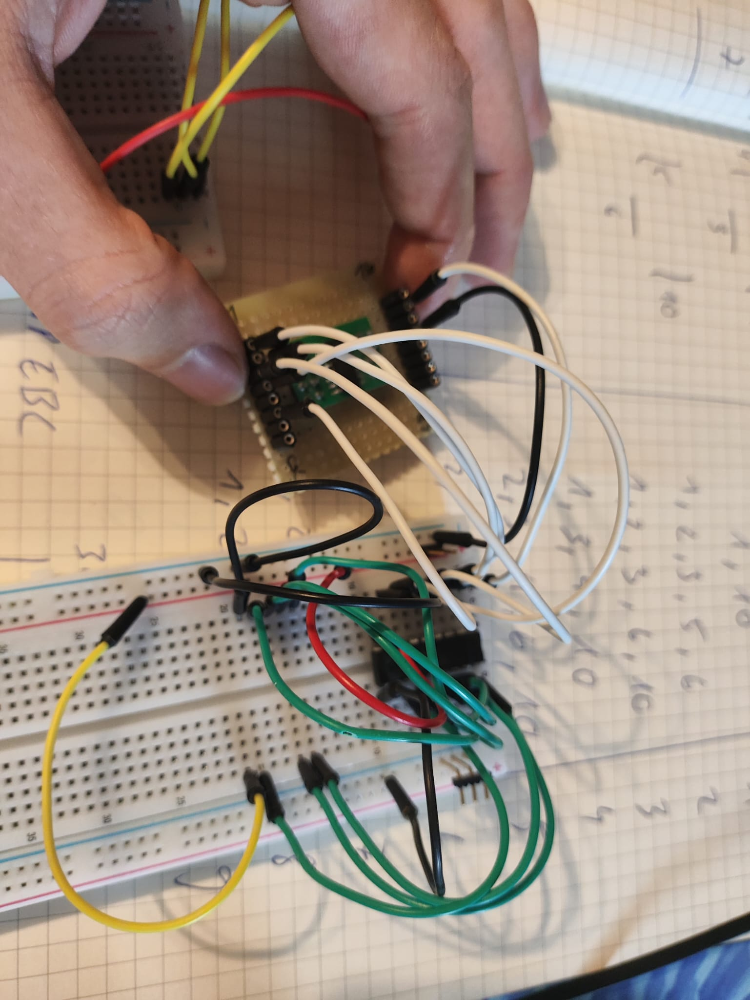

- **Skizzen:**
  - Alles Wichtige habe ich in meinem Notizbuch notiert. Das Wichtigste war die Übersetzungsmatrix von Dezimal zu Hexadezimal. Genaueres erkläre ich im Video.
    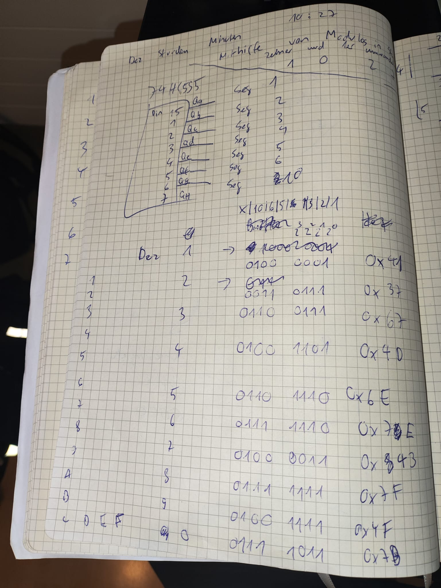
    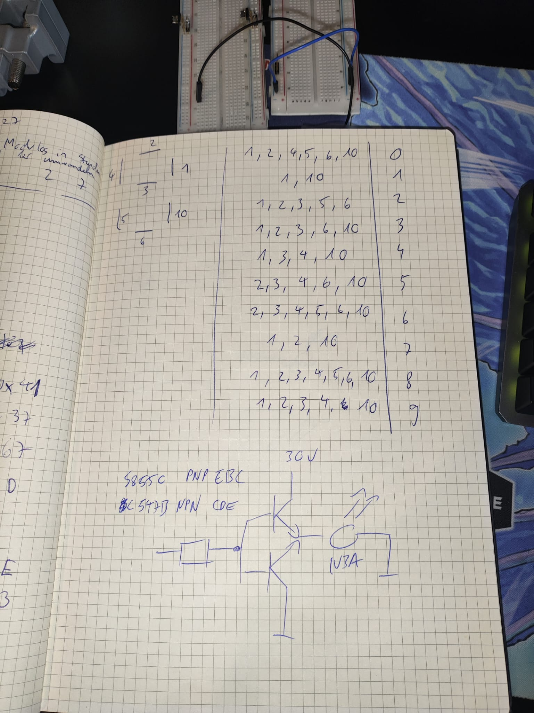

- **Testszenarien:**
  - Spannungsprüfung (5V, +20V, 1V):
    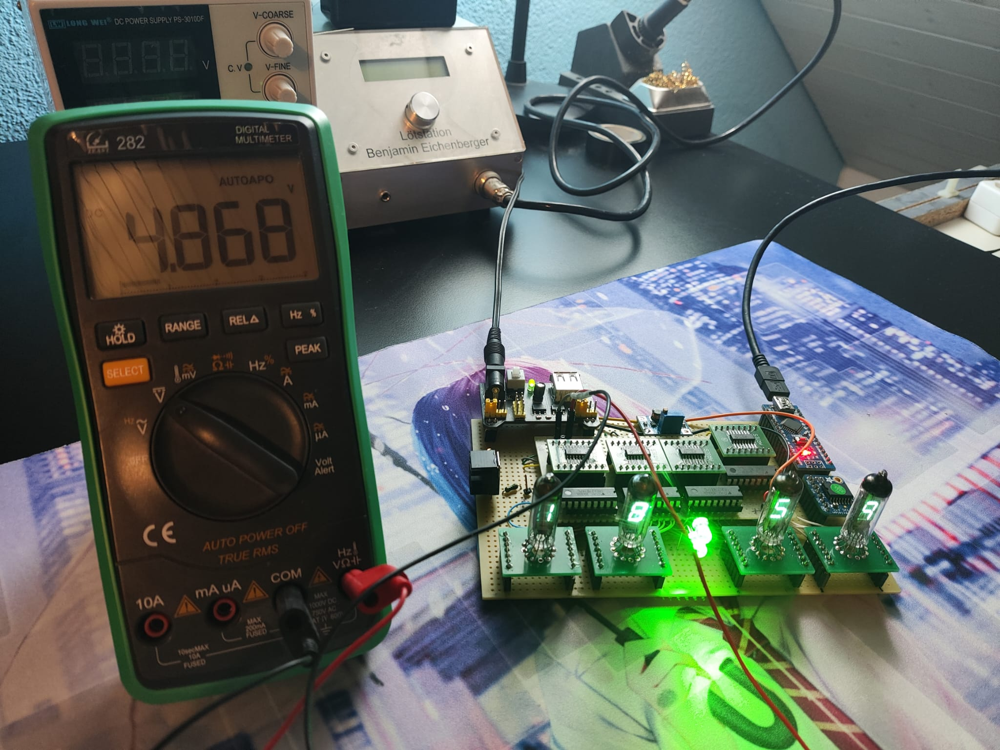
    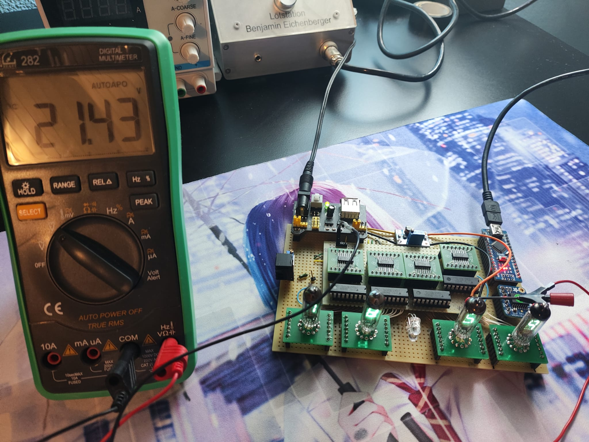
    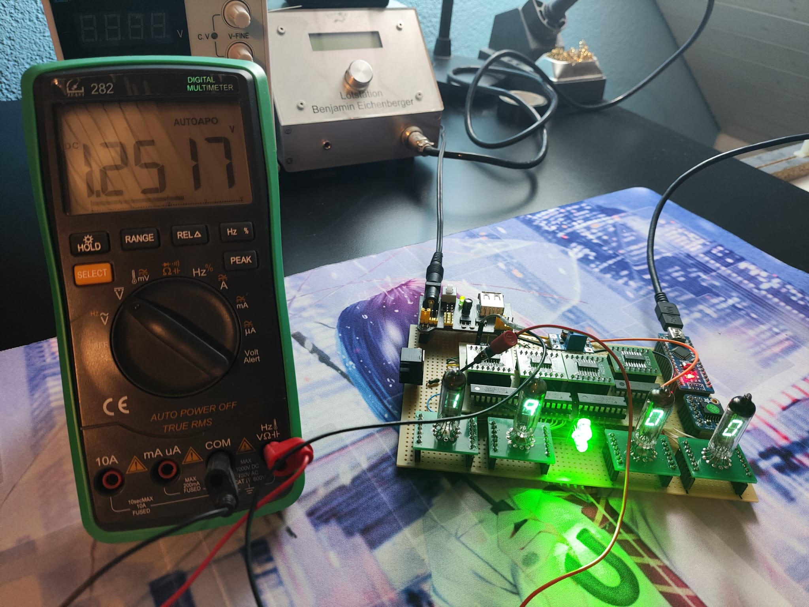
  - I2C-Kommunikation überprüft und Uhrzeit korrekt bei Entfernen des DS3231:
    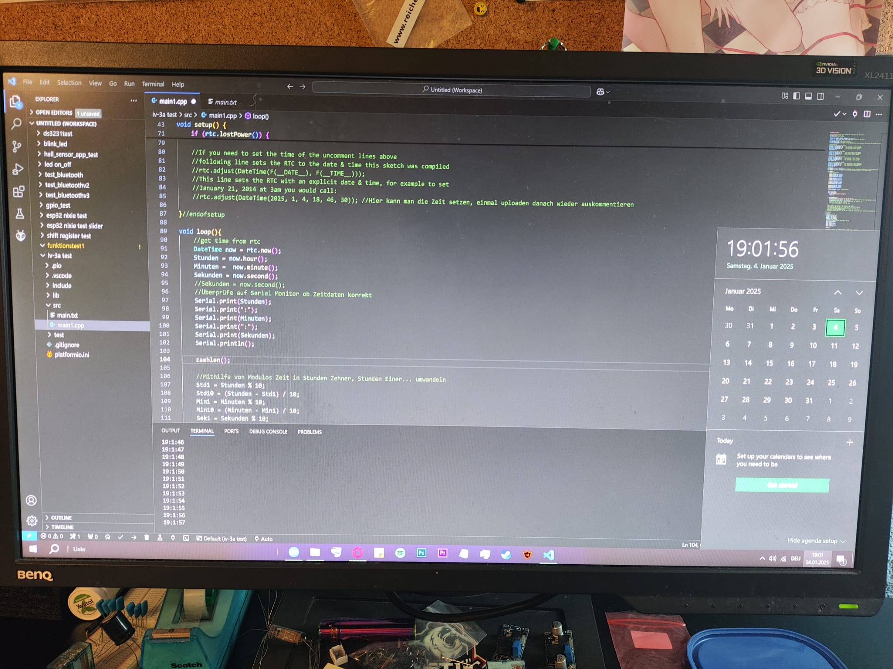
  - Anschaulichkeitsfunktion getestet (siehe Video).

## Werkstatt

Das Projekt wurde auf einer Laborkarte umgesetzt. Die Verbindungen wurden mithilfe von Litzen gelötet.

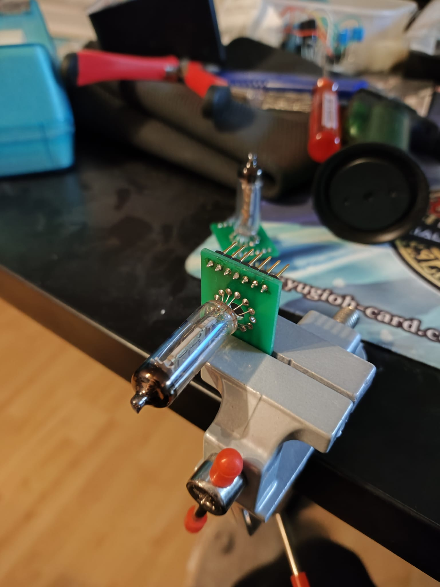
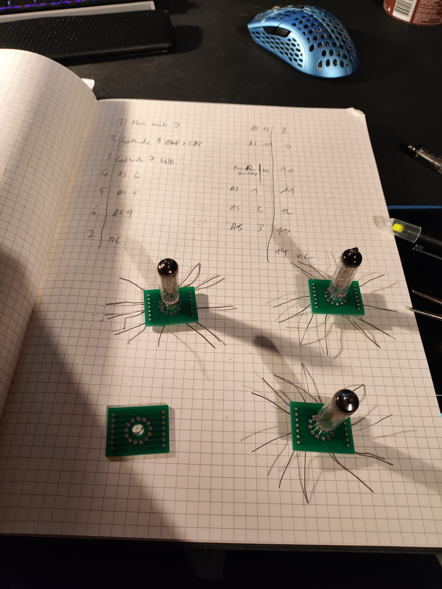
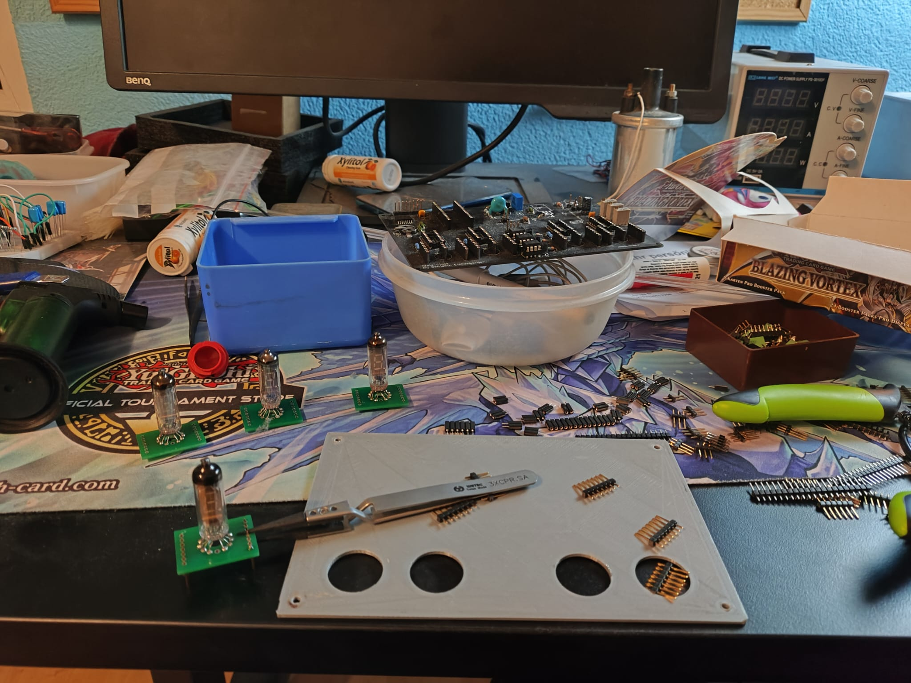
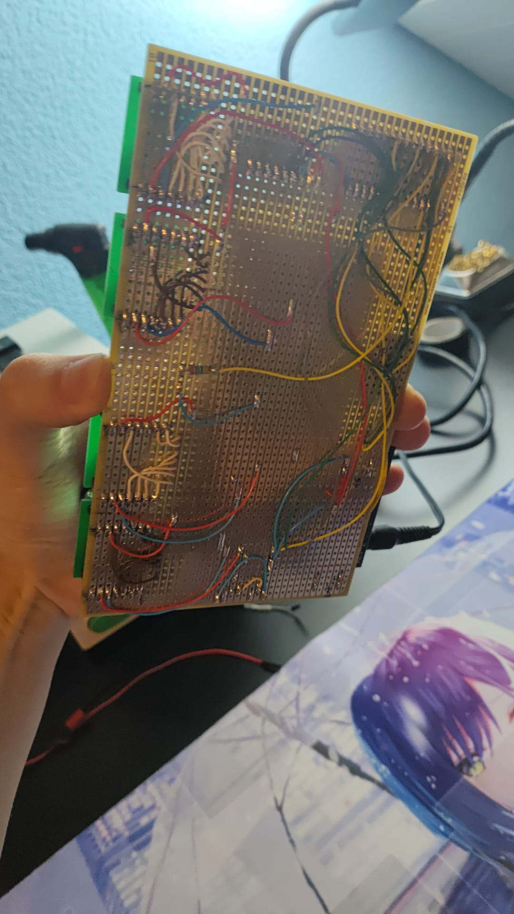

## Endprodukt

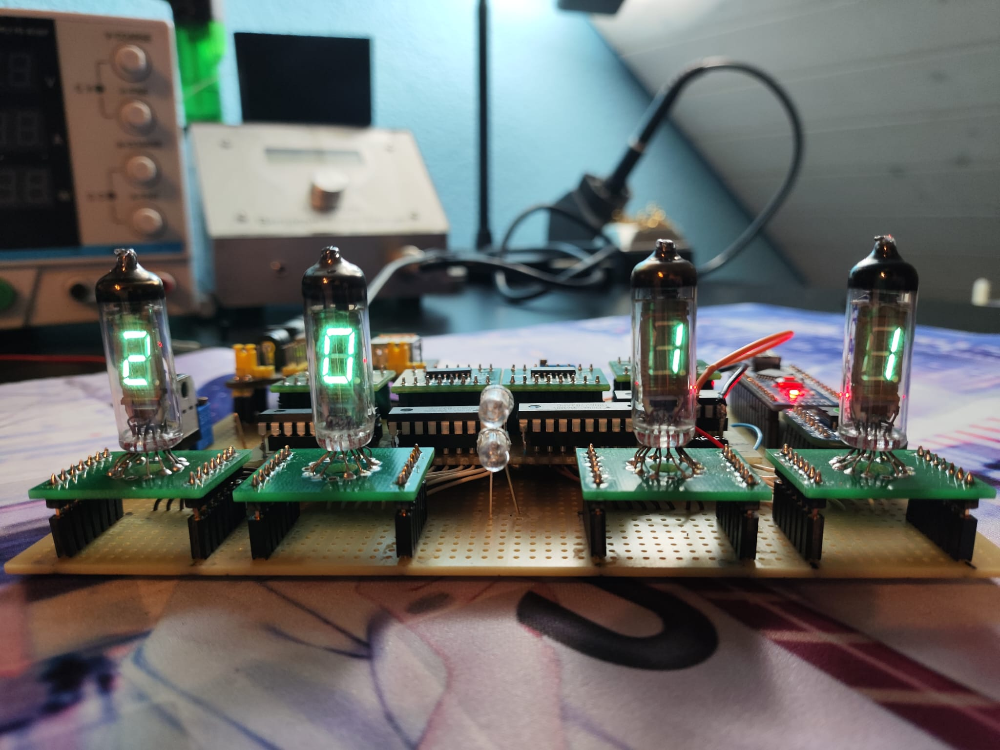
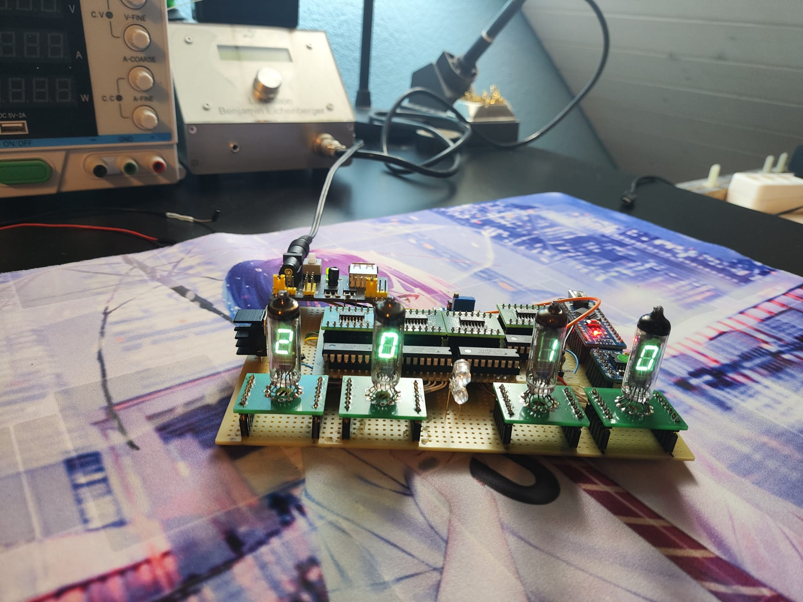
  
