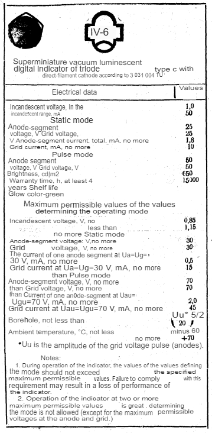
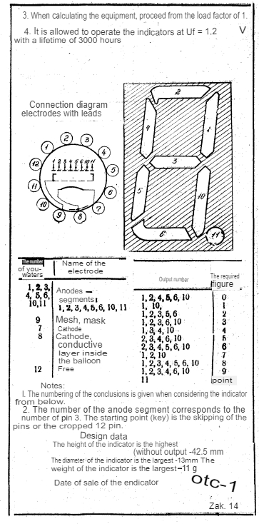
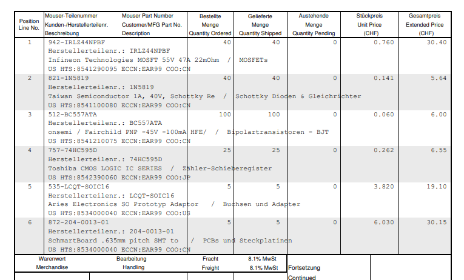
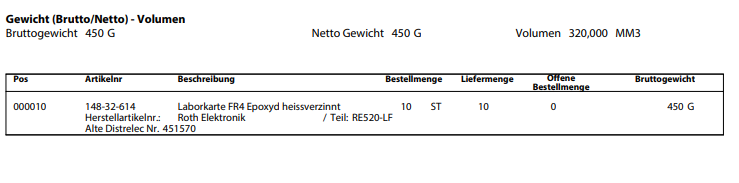

# Digitalröhrenuhr
Mein Projekt ist es eine Uhr zu designen. 4 Digitalröhren werden als Einzeigeelement eingebaut.
Die Ansteuerung der Röhren fungiert über Schieberegister.
Für die Daten der Uhrzeit wird ein Timermodul DS3231 eingebaut.
Der Arduino regelt die Kommunikation des Timermoduls und verarbeitet diese Daten und steuert mehrere Schieberegister an, welche so die Anzeige regulieren.
Das Format der Uhr ist HH:MM. Zusätzlich werden 2 LEDs für den Doppelpunkt angesteuert. Diese können für die Anschaulichkeit durch RGB LEDs erweitert werden.

## Anforderungen
| Anforderung                                                                                                                         | Muss | Wunsch |
| -------------------------------------------------------------------------------------------------------------------                 | ---- | ------ |
| Der Arduino kommuniziert per I2C mit dem Timermodul DS3231                                                                          | X    |        |
| Ansteuerung Anzeigeelemente. Arduino verarbeitet Daten für Stunden und Minuten und schreibt diese auf Schieberegister               | X    |        |
| Uhrzeit wird durch den batteriebetriebenen Timerbaustein gemerkt und läuft korrekt weiter auch wenn die Uhr nicht angeschlossen ist | X    |        |
| LEDs für den Doppelpunkt können konstant leuchten oder im Sekundentakt blinken                                                      | X    |        |
| LEDs werden durch RGB LEDs erweitert                                                                                                |      | X      |
| Anschauchlichkeit. Bei einer vollständigen Stunde laufen die Zahlen bei allen Anzeigeelementen von 0 bis 9 mehrmals schnell durch   |      | X      |                                                       

## Projektplan
- 14.12.2024 - Projektplanbesprechung
- 14.12.2024 - Flussdiagramm erstellt
- 14.12.2024 - Projektplan erstellt
- 18.01.2024 - Kompatibilität von Hardware überprüft
- 20.12.2024 - Schaltung für Versorgungsspannungen designt und getestet
- 21.12.2024 - DS3231 Timerschaltung und Ansteuerung getestet
- 22.12.2024 - Schieberegister Ansteuerung getestet
- 23.12.2024 - Digitalröhren Anstuerung getestet
- 28.12.2024 - Softwarecode geschrieben
- 30.12.2024 - Softwarecode verständlich kommentiert
- 01.01.2024 - Tests abgeschlossen
- 04.01.2025 - Projektabschluss (Video, Dokumentation, Präsentation)

## Flussdiagramm

Der Arduino komminziert über eine I2C-Schnittstelle mit dem Timermodul DS3231. Dadurch gelangt er an die Daten für Stunden und Minuten. Der Mikrocontroller schreibt per digitalen Ausgang
diese Daten auf ein Schieberegister, damit die entsprechenden Zahlen angezeigt werden. HH:MM

## Projektbeschreibung

- Welche Teilfunktionen habt ihr einzeln getestet?
  Einzeln getestet habe ich die Kommunikation zwischen Arduino, Schieberegister und Transistoren-IC
  Kommunikation zwischen Adafruit DS3231 Timermodul und Arduino
  Ausserdem habe ich die Spannungen von den jeweiligen Modulen einzeln überprüft. Da diese schon Endprodukte waren, musste ich nur die gewünschten Spannungen über das Potentiometer einstellen
  Versuchsaufbauten Transistorenansteuerung
- Gab es dabei Probleme, wenn ja welche?
  Ja es gab ein paar Probleme am Anfang. Da diese IV-3A aus Russland kommen und es kein gescheites Datenblatt gab. Habe ich im Internet auf diversen Foren nach Informationen gesucht. Ich stosse auf eine Seite,
  die  vieles gut erklärte. https://zw-ix.nl/blog/tag/iv3-a-datasheet/
  Dieser Blog gab mir eine gute Idee. Das russische Datenblatt mit Google Translate übersetzen. Was ich schliesslich dann auch gemacht habe.
  Datenblatt auf Russisch: https://zw-ix.nl/wp-content/uploads/2019/08/IV-6.pdf
  Übersetzungen:
  
  
  Jedoch führten mich gewisse Information dieses Blogs auch in die Irre. Da genaue Angaben für Ströme und Spannungen angegeben wurde, dachte ich das dies wichtig wäre und ich habe bereits als Vorbereitung gewisse Berechnungen durchgeführt.
  
  Nach weiterem rumstöberen und Sammlung von Inforamtionen, fand ich heraus, dass ich den Strom usw. gar nicht begrenzen muss. Diese Berechnungen waren redundant.

## Entscheidung Komponenten

  Durch ein Video auf YouTube, fand ich einen perfekten IC für die Ansteuerung der Röhren. Nämlich der TBD62783APG. https://www.youtube.com/watch?v=QSLgrnq4o88
  Da ich in meiner Vergangenheit schon einmal mit Shiftregistern und einer Realtimeclock zutun hatte, fiel mir da die Entscheidung leicht.
  Ich entschied mich für das Schiftregister 74HC595 und das Realtimeclockmodul von Adafruit DS3231.
  Für die diversen Spannungen die ich brauch gab es auch eine simple Lösung. Benötigte Spannungen. 5V, circa 1V, und +20V.
  Die 5V nahm ich von einem Modul, was durch ein 12V Netzteil gespiesen wird. Diese 12V kann ich abgreifen und für mein Boost Converter verwenden, welcher mir +20V gibt. Die circa 1V machte ich mir einen simplen Spannungsregler LM317. Die 5V des Moduls habe ich      ebenfalls als Versorgungsspannung für den Arduino verwendet. VIN Pin.
  Den Boost Converter habe ich auf Digitec bestellt und die restlichen benötigten Bauteile auf Mouser Electronics und Distrelec.
  https://www.digitec.ch/de/s1/product/purecrea-dc-dc-15a-step-up-boost-converter-entwicklungsboard-kit-32964682?supplier=8244233
  
  

- Konnten alle Muss-Anforderungen umgesetzt werden?
  Ja, alle muss-Anforderungen
- Nein, warum konnten nicht alle umgesetzt werden?
- War etwas unerwartet beim Schreiben des Programcodes?
  
## Tests TBD...

Kurze Beschreibung der Vorgehensweise
- Was sind die Testscenarios?
- Beschreibung oder Bild das Testziel aufzeigt
- Gibt es spezielle Gründe warum diese Tests gewählt wurden?
