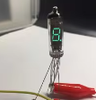
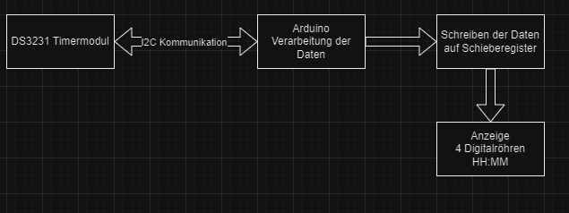

# Digitalröhrenuhr
Mein Projekt ist es eine Uhr zu designen. 4 Digitalröhren werden als Einzeigeelement eingebaut.
Die Ansteuerung der Röhren fungiert über Schieberegister.
Für die Daten der Uhrzeit wird ein Timermodul DS3231 eingebaut.
Der Arduino regelt die Kommunikation des Timermoduls und verarbeitet diese Daten und steuert mehrere Schieberegister an, welche so die Anzeige regulieren.
Das Format der Uhr ist HH:MM. Zusätzlich werden 2 LEDs für den Doppelpunkt angesteuert. Diese können für die Anschaulichkeit durch RGB LEDs erweitert werden.

## Anforderungen
| Anforderung                                                                                                                         | Muss | Wunsch |
| -------------------------------------------------------------------------------------------------------------------                 | ---- | ------ |
| Der Arduino kommuniziert per I2C mit dem Timermodul DS3231                                                                          | X    |        |
| Ansteuerung Anzeigeelemente. Arduino verarbeitet Daten für Stunden und Minuten und schreibt diese auf Schieberegister               | X    |        |
| Uhrzeit wird durch den batteriebetriebnem Timerbaustein gemerkt und läuft korrekt weiter auch wenn die Uhr nicht angeschlossen ist  | X    |        |
| LEDs für den Doppelpunkt können konstant leuchten oder im Sekundentakt blicken                                                      | X    |        |
| LEDs werden durch RGB LEDs erweitert                                                                                                |      | X      |
| Anschauchlichkeit. Bei einer vollständigen Stunde laufen die Zahlen bei allen Anzeigeelementen von 0 bis 9 mehrmals schnell durch   |      | X      |                                                       

## Projektplan
- 14.12.2024 - Projektplanbesprechung
- 14.12.2024 - Flussdiagramm erstellt
- 14.12.2024 - Projektplan erstellt
- 18.01.2024 - Kompatibilität von Hardware überprüft
- 20.12.2024 - Schaltung für Versorgungsspannungen designt und getestet
- 21.12.2024 - DS3231 Timerschaltung und Ansteuerung getestet
- 22.12.2024 - Schieberegister Ansteuerung getestet
- 23.12.2024 - Digitalröhren Anstuerung getestet
- 28.12.2024 - Softwarecode geschrieben
- 30.12.2024 - Softwarecode verständliche kommentiert
- 01.01.2024 - Tests abgeschlossen
- 04.01.2025 - Projektabschluss (Video, Dokumentation, Präsentation)

## Flussdiagramm

Der Arduino komminziert über eine I2C-Schnittstelle mit dem Timermodul DS3231. Dadurch gelangt er an die Daten für Stunden und Minuten. Der Mikrocontroller schreibt per digitalen Ausgang
diese Daten auf ein Schieberegister, damit die entsprechenden Zahlen angezeigt werden. HH:MM

## Projektbeschreibung TBD...

- Welche Teilfunktionen habt ihr einzeln getestet?
- Gab es dabei Probleme, wenn ja welche?
- Konnten alle Muss-Anforderungen umgesetzt werden?
- Nein, warum konnten nicht alle umgesetzt werden?
- War etwas unerwartet beim Schreiben des Programcodes?
  
## Tests TBD...

Kurze Beschreibung der Vorgehensweise
- Was sind die Testscenarios?
- Beschreibung oder Bild das Testziel aufzeigt
- Gibt es spezielle Gründe warum diese Tests gewählt wurden?
